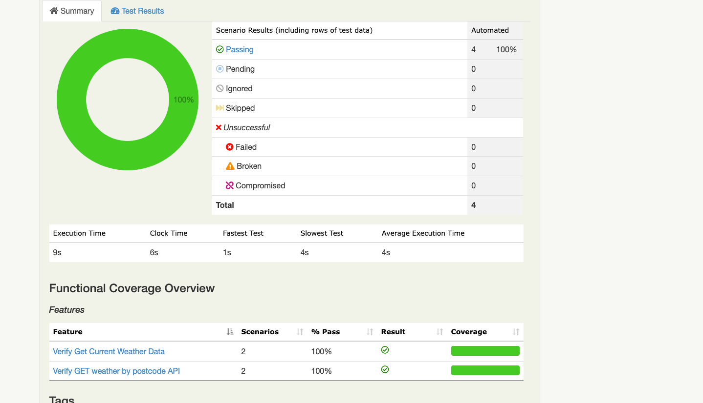

# weatherAPI

RestAssured-BDD-Java- Weather-App

Tools / libraries used :
1.    Java
2.    Rest Assured
3.    Cucumber
4.    JUnit
5.    Maven
6.    Intellij

Steps to start :
1.    Clone / Download the project into your local
2.    Open the Command prompt and navigate to project location
3.    Execute the following Maven command's
      o    mvn clean :- To clean the maven repo
      o    mvn install :- To install the maven requirments
      o    mvn clean verify -DexecEnv=sit -Dcucumber.options="--tags @test"  :- To execute the test scenarios

References :
1.    https://github.com/rest-assured/rest-assured/wiki/usage
2.    https://github.com/angiejones/restassured-with-cucumber-demo
3.    https://github.com/swtestacademy/RestAssuredExample

API used
https://api.weatherbit.io/v2.0/current?lat=20&lon=-21&key=016cff34f8cb49f6995bf135b78e6526'

Report

